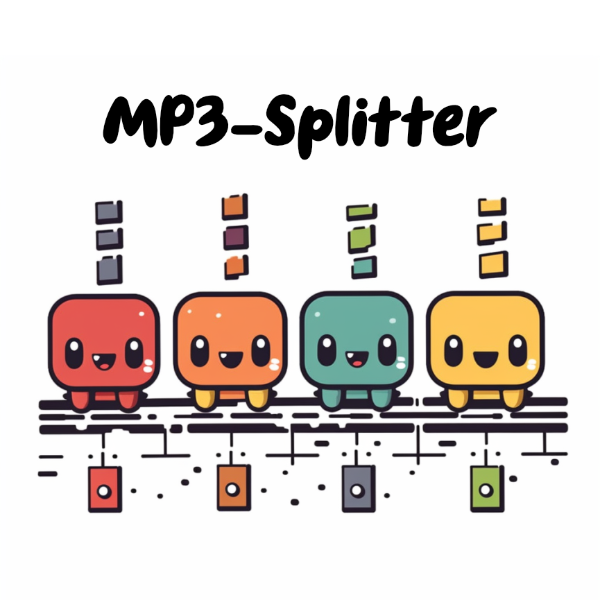
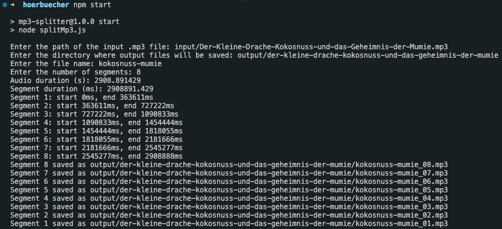

# MP3 Splitter for Children's Stories



The **MP3 Splitter for Children's Stories** is an open-source Node.js project designed to enhance the storytelling experience for children using devices like the Toniebox. This project allows you to effortlessly split longer MP3 files, such as children's stories, into a series of shorter MP3 chunks. These segmented chunks can then be loaded onto compatible devices, enabling children to conveniently navigate forward and backward through story segments without the need to restart from the beginning with every listen.

## Features

- **Segmentation:** The MP3 splitter takes a longer MP3 file and divides it into smaller, manageable segments. This ensures that children can easily navigate to specific parts of the story.

- **Customization:** Tailor the number of segments according to your preferences. You can determine how many segments each story should have, to suit your child's listening habits.

## Getting Started

Follow these steps to start using the MP3 Splitter for Children's Stories:

1. **Clone the Repository:** Begin by cloning this repository to your local machine using the following command:

   ```
   git clone https://github.com/encho/mp3-splitter
   ```

2. **Install Dependencies:** Navigate to the project directory and install the required dependencies by running:

   ```
   npm install
   ```

3. **Run the MP3 Files Splitter:** Place the longer MP3 file (e.g., a children's story) in the designated input folder. Run the splitter script:

   ```
   npm start
   ```

   You will be prompted for input file location, output folder, as well as the initial file name segment of the generated files and the number of generated files. See the following screenshot for an example:

   

4. **Load Segments:** Once the MP3 file is successfully split, transfer the generated segments to your child's device, such as the Toniebox.

5. **Enjoy the Experience:** Watch your children delight in the enhanced storytelling experience. They can now effortlessly navigate through the story using the device's controls.

## License

This project is licensed under the [MIT License](https://opensource.org/licenses/MIT).

---

Empower your children's storytelling adventures with the MP3 Splitter for Children's Stories. Enhance their engagement, promote exploration, and make every listening session a memorable experience. Happy storytelling!
